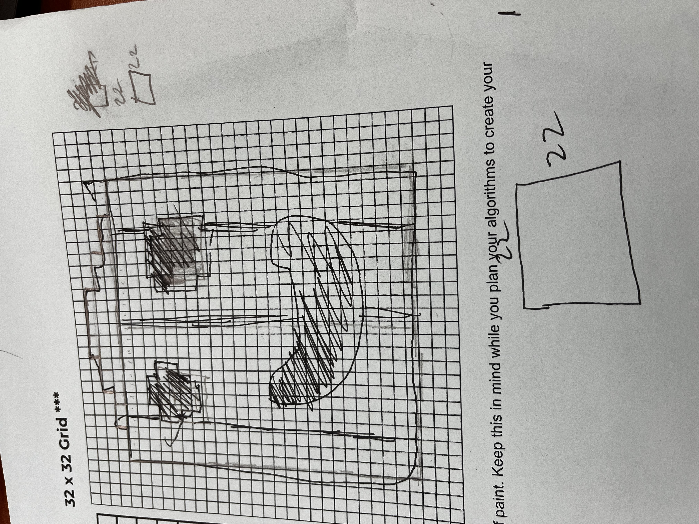
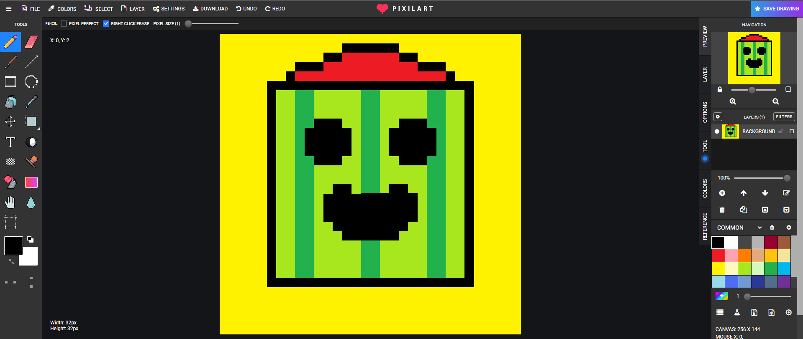
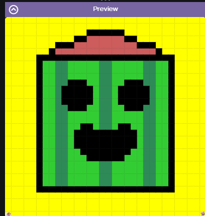

# Asphalt-Art-Project
My code.org Asphalt Art Projecct for Unit 1 APCSA
# Unit 1 - Asphalt Art

## Introduction

Cities use asphalt art to improve public safety, inspire their residents and visitors, and brighten communities. Your goal is to create asphalt art to revitalize The Neighborhood and bring the community together with the help of the Painter.

## Requirements

Use your knowledge of object-oriented programming, algorithms, the problem solving process, and decomposition strategies to create asphalt art:
- **Create a new subclass** – Create at least one new subclass of the PainterPlus class that is used for a component of the asphalt art design.
- **Plan an algorithm** – Use the problem solving process and decomposition strategies to plan an algorithm that incorporates a combination of sequencing, selection, and/or iteration.
- **Write a method** – Write at least one method in a PainterPlus subclass that contributes to a component of the asphalt art design.
- **Document your code** – Use comments to explain the purpose of the methods and code segments.

## Notes: Neighborhood & Painter Class

This project was created on Code.org's JavaLab platform using the built in Neightborhood GUI output. To test and edit this project you must build in Code.org's JavaLab with the Neighborhood GUI enabled. For reference to the Painter class documentation, [you can read more here.](https://studio.code.org/docs/ide/javalab/classes/Painter)

## Output:

# Put sketch 

# Final image here

## Reflection

1. Describe your project.

   This piece of art that I have created is a 2 dimensional head of a character named Spike from the video game brawlstars. It features his hat that is a mix of orange and red I used indian red for that color. It shows the pattern of his dark and light green on the face. The face itself is a 22x22 square surrounded by a black outline. The yellow background represents the color of his rarity in game which is legendary.

2. What are two things about your project that you are proud of?

   One thing I am proud of is the method I created called moveSpaces. This method is to make code look much simpler. It works the same way as paintLine except it doesn't paint it only moves by the integer inputed. By this instead of moving 13 times for example I just need to put painter.moveSpaces(13);. I was able to code this by using the paintLine as a reference and just removing and changing some aspects of it.

   Another thing I am proud of is how close it is to the design I sketeched first. Using a website (www.pixilart.com) I was able to make a 32x32 canvas and sketch a design to see how I wanted it to look or change anything. The final product looks nearly identical besides the grid lines and different colors.

3. Describe something you would improve or do differently if you had an opportunity to change something about your project.

   I think if I wanted to improve something I would want to add more to the background. I feel just a yellow background is boring, I could of added more to it like stripes of lighter shades in the middle.